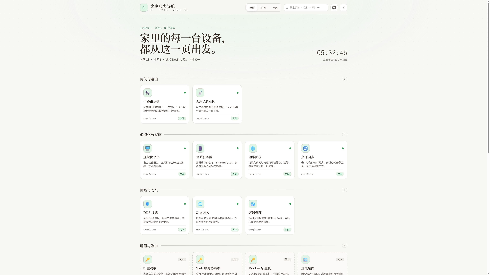
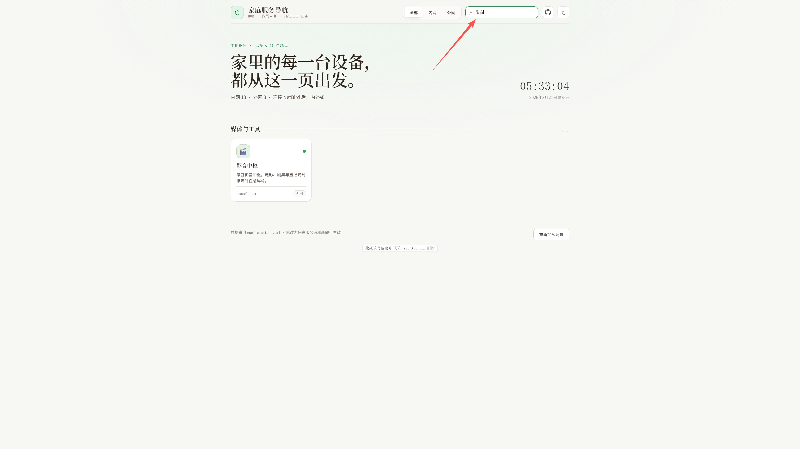

# HomeDock · 家庭服务导航

> 英文版 / English: [README.en.md](./README.en.md)

一个轻量的单页服务导航面板，把家里的每一台设备、每一个服务集中到一个页面，一键直达。`public/config/` 中的站点配置可直接编辑，替换为你自己的服务即可使用。

## 特性

- 数据驱动：用 YAML / JSON / Markdown 维护服务清单，零后端、纯静态，改完刷新即生效。
- 三态筛选 + 搜索：内网 / 外网 / 通用，配合实时搜索快速定位。
- 端口卡模式：展示主机与端口（SSH / RDP），一键复制连接命令。
- 明暗主题、响应式布局、实时时钟。
- 顶部 GitHub 入口，方便开源协作。

## 预览





## 快速开始

```bash
pnpm install      # 安装依赖
pnpm dev         # 本地开发
pnpm build       # 生产构建
pnpm preview     # 预览构建产物
```

## 配置

服务数据位于 `public/config/`，应用按优先级自动读取：`sites.yaml` > `sites.json` > `sites.md`，编辑其中任意一个即可。

### 字段说明

| 字段 | 说明 | 可选值 |
| --- | --- | --- |
| `name` | 服务名称 | 必填 |
| `description` | 一句话说明 | 可选 |
| `category` | 分组名（决定卡片分组） | 可选 |
| `scope` | 网络范围 | `internal` / `external` / `both` |
| `type` | 卡片类型：link 可点击 / info 仅展示端口 | `link` / `info` |
| `url` | 可点击链接（link 类型必填） | — |
| `icon` | emoji 图标 | 可选 |
| `host` | 主机地址（info 卡使用） | 可选 |
| `ports` | 端口清单，如 `["22 / SSH"]` | 可选 |
| `status` | 状态指示灯 | `online` / `closed` / `unknown` |
| `note` | 备注 | 可选 |

### 语法示例

```markdown
## 分类
- [服务名](https://example.com) 一句话说明 @external :🌐: status:online
- 端口卡 一句话说明 @internal :🔑: host: 10.0.0.1 ports: 22 / SSH status:online
```

`@scope` 控制内网/外网筛选，`:icon:` 为 emoji，三者均可省略；`status` 控制卡片状态灯。

## 部署

`pnpm build` 后，`dist/` 是纯静态产物，可托管到任意静态空间（GitHub Pages、Vercel、Cloudflare Pages、Nginx 等）。

## 许可证

MIT
